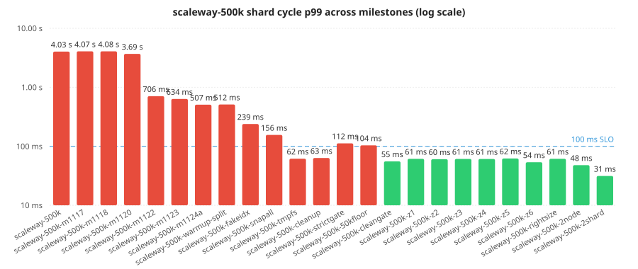

# Scale-test results

Each run is one full pass through the scaletest harness: chart install, ramp to steady state, soak, prometheus snapshot, summary. Runs live in [`test/scaletest/results/`](https://github.com/intUnderflow/bigfleet/tree/main/test/scaletest/results) on GitHub; this page is generated from each run's `summary.json` and refreshes whenever the site builds.

Two regimes, two grading rules. The **aggregated-catalog ladder** below is graded against the canonical bar — sustained active CRs ≥ 99.9 % of target, cycle p99 ≤ 100 ms, rollup p99 ≤ 1 s, ack p99 ≤ 12 s. Older runs recorded as `passed: true` by an earlier runner without a sustained-load gate appear as ✗ when they didn't hold target load. The **realistic-catalog ladder** (uber-*) sits in a separate section below and is graded against the regime-aware envelopes defined in [ADR-0028](./adr/0028-cycle-p99-is-regime-parametric.md): per-Need cost ≤ 200 µs (constant), with cycle and ramp envelopes scaling with NeedsTable cardinality.

## Per-shard 500K optimisation trajectory

The paper sets 500K machines as the per-shard cycle ceiling (Phase 3 walks the inventory each cycle), so most BigFleet optimisation work happens against the scaleway-500k profile: a single shard, 50 simulated clusters, 50 000 demand CRs, 500 000 pre-seeded inventory machines on Scaleway Kapsule (PRO2-M, fr-par / nl-ams). Each milestone landed a real shard or harness change; the chart below tracks shard cycle p99 across those runs. Multi-shard tests (scaleway-1m, scaleway-5m) build on the per-shard ceiling validated here.

**4.03 s → 48 ms** (98.8 % reduction). The most recent single-shard run that meets the SLO at full sustained load is [`scaleway-500k-2node`](https://github.com/intUnderflow/bigfleet/tree/main/test/scaletest/results/20260505-011213-scaleway-500k-2node).

The dashed blue line is the 100 ms cycle SLO. Bars are coloured green only when the run held target load *and* hit every SLO ceiling.

## All runs

The rundir name encodes the fleet size tested (scaleway-500k = single-shard 500K, scaleway-1m = 2 × 500K, scaleway-5m = 10 × 500K — the paper's per-shard ceiling is 500K, so multi-shard runs are aggregate-named). "load" is observed sustained CRs over the target. A run only passes if it held target load *and* hit every SLO.

| run | cycle p99 | ack p99 | rollup p99 | load | pass |
|---|---|---|---|---|---|
| [`m11.9b`](https://github.com/intUnderflow/bigfleet/tree/main/test/scaletest/results/20260501-145151-m11.9b) | 1 ms | — | 2.05 s | 5000 / 5000 | ✗ |
| [`m11.10`](https://github.com/intUnderflow/bigfleet/tree/main/test/scaletest/results/20260501-150219-m11.10) | 1 ms | 20.48 s | 508 ms | 5000 / 5000 | ✗ |
| [`local-50k`](https://github.com/intUnderflow/bigfleet/tree/main/test/scaletest/results/20260501-153557-local-50k) | 7 ms | 18.91 s | 2.05 s | 50000 / 50000 | ✗ |
| [`local-50k`](https://github.com/intUnderflow/bigfleet/tree/main/test/scaletest/results/20260501-154725-local-50k) | 8 ms | 10.48 s | 1.85 s | 49999 / 50000 | ✗ |
| [`local-50k-v3`](https://github.com/intUnderflow/bigfleet/tree/main/test/scaletest/results/20260501-160516-local-50k-v3) | 4 ms | 9.99 s | 1.47 s | 49999 / 50000 | ✗ |
| [`scaleway-50k`](https://github.com/intUnderflow/bigfleet/tree/main/test/scaletest/results/20260501-165809-scaleway-50k) | 2 ms | 9.97 s | 122 ms | 50000 / 50000 | ✓ |
| [`scaleway-50k-v2`](https://github.com/intUnderflow/bigfleet/tree/main/test/scaletest/results/20260501-174325-scaleway-50k-v2) | 2 ms | 8.07 s | 79 ms | 50000 / 50000 | ✓ |
| [`scaleway-500k`](https://github.com/intUnderflow/bigfleet/tree/main/test/scaletest/results/20260501-190456-scaleway-500k) | 4.03 s | 513 ms | 18 ms | 50000 / 50000 | ✗ |
| [`scaleway-500k-m1117`](https://github.com/intUnderflow/bigfleet/tree/main/test/scaletest/results/20260502-022847-scaleway-500k-m1117) | 4.07 s | 493 ms | 16 ms | 49997 / 50000 | ✗ |
| [`scaleway-500k-m1118`](https://github.com/intUnderflow/bigfleet/tree/main/test/scaletest/results/20260502-025246-scaleway-500k-m1118) | 4.08 s | 542 ms | 16 ms | 50000 / 50000 | ✗ |
| [`scaleway-500k-m1120`](https://github.com/intUnderflow/bigfleet/tree/main/test/scaletest/results/20260502-104945-scaleway-500k-m1120) | 3.69 s | 459 ms | 16 ms | 48000 / 50000 | ✗ |
| [`scaleway-500k-m1122`](https://github.com/intUnderflow/bigfleet/tree/main/test/scaletest/results/20260502-115342-scaleway-500k-m1122) | 706 ms | 496 ms | 19 ms | 47999 / 50000 | ✗ |
| [`scaleway-500k-m1123`](https://github.com/intUnderflow/bigfleet/tree/main/test/scaletest/results/20260502-124541-scaleway-500k-m1123) | 634 ms | 504 ms | 16 ms | 50000 / 50000 | ✗ |
| [`scaleway-500k-m1124a`](https://github.com/intUnderflow/bigfleet/tree/main/test/scaletest/results/20260503-224604-scaleway-500k-m1124a) | 507 ms | 391 ms | 16 ms | 49000 / 50000 | ✗ |
| [`scaleway-500k-warmup-split`](https://github.com/intUnderflow/bigfleet/tree/main/test/scaletest/results/20260503-233227-scaleway-500k-warmup-split) | 512 ms | 475 ms | 780 ms | 14755 / 50000 | ✗ |
| [`scaleway-500k-fakeidx`](https://github.com/intUnderflow/bigfleet/tree/main/test/scaletest/results/20260504-001519-scaleway-500k-fakeidx) | 239 ms | 278 ms | 694 ms | 17586 / 50000 | ✗ |
| [`scaleway-500k-snapall`](https://github.com/intUnderflow/bigfleet/tree/main/test/scaletest/results/20260504-083940-scaleway-500k-snapall) | 156 ms | 4.64 s | 900 ms | 37329 / 50000 | ✗ |
| [`scaleway-500k-tmpfs`](https://github.com/intUnderflow/bigfleet/tree/main/test/scaletest/results/20260504-091949-scaleway-500k-tmpfs) | 62 ms | 380 ms | 830 ms | 13464 / 50000 | ✗ |
| [`scaleway-500k-cleanup`](https://github.com/intUnderflow/bigfleet/tree/main/test/scaletest/results/20260504-170304-scaleway-500k-cleanup) | 63 ms | 3.31 s | 878 ms | 27893 / 50000 | ✗ |
| [`scaleway-500k-strictgate`](https://github.com/intUnderflow/bigfleet/tree/main/test/scaletest/results/20260504-171932-scaleway-500k-strictgate) | 112 ms | 1.17 s | 867 ms | 35262 / 50000 | ✗ |
| [`scaleway-500k-50kfloor`](https://github.com/intUnderflow/bigfleet/tree/main/test/scaletest/results/20260504-175730-scaleway-500k-50kfloor) | 104 ms | 1.15 s | 894 ms | 30399 / 50000 | ✗ |
| [`scaleway-500k-cleangate`](https://github.com/intUnderflow/bigfleet/tree/main/test/scaletest/results/20260504-184208-scaleway-500k-cleangate) | 55 ms | 156 ms | 16 ms | 50000 / 50000 | ✓ |
| [`scaleway-50k-verify`](https://github.com/intUnderflow/bigfleet/tree/main/test/scaletest/results/20260504-202548-scaleway-50k-verify) | 16 ms | 255 ms | 15 ms | 50000 / 50000 | ✓ |
| [`scaleway-50k-repro1`](https://github.com/intUnderflow/bigfleet/tree/main/test/scaletest/results/20260504-210908-scaleway-50k-repro1) | 16 ms | 252 ms | 15 ms | 50000 / 50000 | ✓ |
| [`scaleway-50k-repro2`](https://github.com/intUnderflow/bigfleet/tree/main/test/scaletest/results/20260504-210908-scaleway-50k-repro2) | 16 ms | 236 ms | 15 ms | 49999 / 50000 | ✓ |
| [`scaleway-50k-repro3`](https://github.com/intUnderflow/bigfleet/tree/main/test/scaletest/results/20260504-210908-scaleway-50k-repro3) | 16 ms | 239 ms | 15 ms | 49999 / 50000 | ✓ |
| [`scaleway-50k-repro4`](https://github.com/intUnderflow/bigfleet/tree/main/test/scaletest/results/20260504-210908-scaleway-50k-repro4) | 16 ms | 244 ms | 15 ms | 50000 / 50000 | ✓ |
| [`scaleway-500k-z1`](https://github.com/intUnderflow/bigfleet/tree/main/test/scaletest/results/20260504-221018-scaleway-500k-z1) | 61 ms | 202 ms | 26 ms | 50000 / 50000 | ✓ |
| [`scaleway-500k-z2`](https://github.com/intUnderflow/bigfleet/tree/main/test/scaletest/results/20260504-221018-scaleway-500k-z2) | 60 ms | 156 ms | 24 ms | 50000 / 50000 | ✓ |
| [`scaleway-500k-z3`](https://github.com/intUnderflow/bigfleet/tree/main/test/scaletest/results/20260504-221018-scaleway-500k-z3) | 61 ms | 217 ms | 16 ms | 49998 / 50000 | ✓ |
| [`scaleway-500k-z4`](https://github.com/intUnderflow/bigfleet/tree/main/test/scaletest/results/20260504-221018-scaleway-500k-z4) | 61 ms | 189 ms | 21 ms | 50000 / 50000 | ✓ |
| [`scaleway-500k-z5`](https://github.com/intUnderflow/bigfleet/tree/main/test/scaletest/results/20260504-221018-scaleway-500k-z5) | 62 ms | 181 ms | 20 ms | 49999 / 50000 | ✓ |
| [`scaleway-500k-z6`](https://github.com/intUnderflow/bigfleet/tree/main/test/scaletest/results/20260504-221018-scaleway-500k-z6) | 54 ms | 146 ms | 16 ms | 49999 / 50000 | ✓ |
| [`scaleway-500k-rightsize`](https://github.com/intUnderflow/bigfleet/tree/main/test/scaletest/results/20260505-005134-scaleway-500k-rightsize) | 61 ms | 157 ms | 16 ms | 50000 / 50000 | ✓ |
| [`scaleway-500k-2node`](https://github.com/intUnderflow/bigfleet/tree/main/test/scaletest/results/20260505-011213-scaleway-500k-2node) | 48 ms | 109 ms | 15 ms | 50000 / 50000 | ✓ |
| [`scaleway-1m`](https://github.com/intUnderflow/bigfleet/tree/main/test/scaletest/results/20260505-020833-scaleway-1m) | 31 ms | 158 ms | 26 ms | 50000 / 50000 | ✓ |
| [`failover-leader-kill`](https://github.com/intUnderflow/bigfleet/tree/main/test/scaletest/results/20260505-191344-failover-leader-kill) | 16 ms | 75 ms | 14 ms | 50000 / 50000 | ✓ |
| [`failover-leader-kill`](https://github.com/intUnderflow/bigfleet/tree/main/test/scaletest/results/20260505-194845-failover-leader-kill) | 16 ms | 79 ms | 14 ms | 50000 / 50000 | ✓ |
| [`scaleway-1m`](https://github.com/intUnderflow/bigfleet/tree/main/test/scaletest/results/20260505-203638-scaleway-1m) | 967 ms | 2.55 s | 495 ms | 999967 / 1000000 | ✗ |
| [`scaleway-1m`](https://github.com/intUnderflow/bigfleet/tree/main/test/scaletest/results/20260505-224242-scaleway-1m) | 817 ms | 4.28 s | 499 ms | 999963 / 1000000 | ✗ |
| [`dev-5k`](https://github.com/intUnderflow/bigfleet/tree/main/test/scaletest/results/20260506-022153-dev-5k) | 29 ms | 5.03 s | 5.12 s | 4349 / 5000 | ✗ |
| [`dev-5k-pods-loopback`](https://github.com/intUnderflow/bigfleet/tree/main/test/scaletest/results/20260506-024211-dev-5k-pods-loopback) | 58 ms | 9.66 s | 1.54 s | 400 / 600 | ✗ |
| [`dev-5k-pods-loopback`](https://github.com/intUnderflow/bigfleet/tree/main/test/scaletest/results/20260506-030209-dev-5k-pods-loopback) | — | — | — | — | ✓ |
| [`dev-5k-pods-loopback`](https://github.com/intUnderflow/bigfleet/tree/main/test/scaletest/results/20260506-031922-dev-5k-pods-loopback) | 11 ms | 90 ms | 14 ms | 600 / 600 | ✓ |
| [`scaleway-500k`](https://github.com/intUnderflow/bigfleet/tree/main/test/scaletest/results/20260506-231218-scaleway-500k) | 793 ms | 136 ms | 16 ms | 50000 / 50000 | ✗ |
| [`scaleway-500k`](https://github.com/intUnderflow/bigfleet/tree/main/test/scaletest/results/20260507-012155-scaleway-500k) | 645 ms | 94 ms | 15 ms | 50000 / 50000 | ✗ |
| [`scaleway-500k`](https://github.com/intUnderflow/bigfleet/tree/main/test/scaletest/results/20260507-020933-scaleway-500k) | 31 ms | 5.03 s | 23 ms | 5000 / 50000 | ✗ |
| [`dev-5k`](https://github.com/intUnderflow/bigfleet/tree/main/test/scaletest/results/20260507-023831-dev-5k) | — | — | — | — | ✓ |
| [`dev-5k`](https://github.com/intUnderflow/bigfleet/tree/main/test/scaletest/results/20260507-025002-dev-5k) | 43 ms | 5.02 s | 5.46 s | 3539 / 5000 | ✗ |
| [`dev-5k`](https://github.com/intUnderflow/bigfleet/tree/main/test/scaletest/results/20260507-025330-dev-5k) | 31 ms | 5.03 s | 1.49 s | 5000 / 5000 | ✗ |
| [`dev-5k`](https://github.com/intUnderflow/bigfleet/tree/main/test/scaletest/results/20260507-025820-dev-5k) | 824 ms | 5.02 s | 1.52 s | 3339 / 5000 | ✗ |
| [`dev-5k`](https://github.com/intUnderflow/bigfleet/tree/main/test/scaletest/results/20260507-030133-dev-5k) | 30 ms | 77 ms | 31 ms | 5000 / 5000 | ✓ |
| [`dev-5k`](https://github.com/intUnderflow/bigfleet/tree/main/test/scaletest/results/20260507-031806-dev-5k) | 23 ms | 76 ms | 31 ms | 5000 / 5000 | ✓ |
| [`dev-5k`](https://github.com/intUnderflow/bigfleet/tree/main/test/scaletest/results/20260507-032920-dev-5k) | 1.01 s | 156 ms | 31 ms | 5000 / 5000 | ✗ |
| [`scaleway-50k`](https://github.com/intUnderflow/bigfleet/tree/main/test/scaletest/results/20260507-120335-scaleway-50k) | 8.19 s | 631 ms | 121 ms | 49999 / 50000 | ✗ |
| [`scaleway-50k`](https://github.com/intUnderflow/bigfleet/tree/main/test/scaletest/results/20260507-134343-scaleway-50k) | 8.19 s | 954 ms | 125 ms | 49999 / 50000 | ✗ |
| [`scaleway-50k`](https://github.com/intUnderflow/bigfleet/tree/main/test/scaletest/results/20260507-155042-scaleway-50k) | 255 ms | 840 ms | 64 ms | 49997 / 50000 | ✗ |
| [`scaleway-50k`](https://github.com/intUnderflow/bigfleet/tree/main/test/scaletest/results/20260508-002512-scaleway-50k) | 294 ms | 726 ms | 63 ms | 49996 / 50000 | ✗ |
| [`scaleway-50k`](https://github.com/intUnderflow/bigfleet/tree/main/test/scaletest/results/20260508-010641-scaleway-50k) | 493 ms | 975 ms | 63 ms | 49997 / 50000 | ✗ |
| [`scaleway-50k`](https://github.com/intUnderflow/bigfleet/tree/main/test/scaletest/results/20260508-015734-scaleway-50k) | 459 ms | 1.03 s | 63 ms | 49998 / 50000 | ✗ |
| [`scaleway-50k`](https://github.com/intUnderflow/bigfleet/tree/main/test/scaletest/results/20260508-021906-scaleway-50k) | 436 ms | 916 ms | 64 ms | 49999 / 50000 | ✗ |
| [`scaleway-50k`](https://github.com/intUnderflow/bigfleet/tree/main/test/scaletest/results/20260508-135450-scaleway-50k) | 8.19 s | 2.41 s | 63 ms | 49995 / 50000 | ✗ |
| [`scaleway-50k`](https://github.com/intUnderflow/bigfleet/tree/main/test/scaletest/results/20260508-141939-scaleway-50k) | 4.01 s | 886 ms | 63 ms | 49998 / 50000 | ✗ |
| [`scaleway-50k`](https://github.com/intUnderflow/bigfleet/tree/main/test/scaletest/results/20260508-171343-scaleway-50k) | 2.02 s | 1.08 s | 127 ms | 49998 / 50000 | ✗ |
| [`scaleway-50k`](https://github.com/intUnderflow/bigfleet/tree/main/test/scaletest/results/20260509-005319-scaleway-50k) | 2.01 s | 81 ms | 126 ms | 49998 / 50000 | ✗ |
| [`scaleway-50k`](https://github.com/intUnderflow/bigfleet/tree/main/test/scaletest/results/20260509-014621-scaleway-50k) | 508 ms | 280 ms | 52 ms | 49996 / 50000 | ✗ |
| [`scaleway-50k`](https://github.com/intUnderflow/bigfleet/tree/main/test/scaletest/results/20260509-124308-scaleway-50k) | 977 ms | 1.43 s | 62 ms | 49994 / 50000 | ✗ |
| [`scaleway-50k`](https://github.com/intUnderflow/bigfleet/tree/main/test/scaletest/results/20260509-134511-scaleway-50k) | 906 ms | 1.28 s | 60 ms | 49996 / 50000 | ✗ |
| [`scaleway-50k`](https://github.com/intUnderflow/bigfleet/tree/main/test/scaletest/results/20260510-231654-scaleway-50k) | 510 ms | 2.12 s | 58 ms | 49992 / 50000 | ✗ |
| [`scaleway-50k`](https://github.com/intUnderflow/bigfleet/tree/main/test/scaletest/results/20260510-235737-scaleway-50k) | 511 ms | 2.07 s | 57 ms | 49992 / 50000 | ✗ |
| [`scaleway-50k`](https://github.com/intUnderflow/bigfleet/tree/main/test/scaletest/results/20260511-093430-scaleway-50k) | 788 ms | 379 ms | 58 ms | 49992 / 50000 | ✗ |
| [`scaleway-50k`](https://github.com/intUnderflow/bigfleet/tree/main/test/scaletest/results/20260511-103134-scaleway-50k) | 566 ms | 410 ms | 58 ms | 49993 / 50000 | ✗ |
| [`scaleway-50k`](https://github.com/intUnderflow/bigfleet/tree/main/test/scaletest/results/20260511-123320-scaleway-50k) | 8.19 s | 31.40 s | 112 ms | 49973 / 50000 | ✗ |
| [`scaleway-50k`](https://github.com/intUnderflow/bigfleet/tree/main/test/scaletest/results/20260511-131039-scaleway-50k) | 684 ms | 386 ms | 60 ms | 49991 / 50000 | ✗ |
| [`scaleway-50k`](https://github.com/intUnderflow/bigfleet/tree/main/test/scaletest/results/20260511-135036-scaleway-50k) | 898 ms | 381 ms | 58 ms | 49994 / 50000 | ✗ |
| [`scaleway-50k`](https://github.com/intUnderflow/bigfleet/tree/main/test/scaletest/results/20260511-141345-scaleway-50k) | 793 ms | 317 ms | 59 ms | 49995 / 50000 | ✗ |
| [`scaleway-50k`](https://github.com/intUnderflow/bigfleet/tree/main/test/scaletest/results/20260511-155334-scaleway-50k) | 510 ms | 317 ms | 49 ms | 49996 / 50000 | ✗ |
| [`scaleway-50k`](https://github.com/intUnderflow/bigfleet/tree/main/test/scaletest/results/20260511-171546-scaleway-50k) | 637 ms | 310 ms | 52 ms | 49995 / 50000 | ✗ |
| [`scaleway-50k`](https://github.com/intUnderflow/bigfleet/tree/main/test/scaletest/results/20260511-180838-scaleway-50k) | 499 ms | 101 ms | 30 ms | 49999 / 50000 | ✗ |
| [`scaleway-50k`](https://github.com/intUnderflow/bigfleet/tree/main/test/scaletest/results/20260511-183447-scaleway-50k) | 505 ms | 127 ms | 30 ms | 49997 / 50000 | ✗ |
| [`scaleway-50k`](https://github.com/intUnderflow/bigfleet/tree/main/test/scaletest/results/20260511-201325-scaleway-50k) | 502 ms | 147 ms | 31 ms | 49999 / 50000 | ✗ |
| [`scaleway-50k`](https://github.com/intUnderflow/bigfleet/tree/main/test/scaletest/results/20260511-215133-scaleway-50k) | 494 ms | 81 ms | 29 ms | 49998 / 50000 | ✗ |
| [`dev-5k`](https://github.com/intUnderflow/bigfleet/tree/main/test/scaletest/results/20260512-013758-dev-5k) | 889 ms | 19.40 s | 1.57 s | 3516 / 5000 | ✗ |
| [`dev-5k`](https://github.com/intUnderflow/bigfleet/tree/main/test/scaletest/results/20260512-020134-dev-5k) | 157 ms | 9.77 s | 123 ms | 1837 / 5000 | ✗ |
| [`dev-5k`](https://github.com/intUnderflow/bigfleet/tree/main/test/scaletest/results/20260512-020916-dev-5k) | 116 ms | 4.79 s | 1.97 s | 76 / 2500 | ✗ |
| [`dev-500`](https://github.com/intUnderflow/bigfleet/tree/main/test/scaletest/results/20260512-145040-dev-500) | 56 ms | 77 ms | 63 ms | 49998 / 50000 | ✓ |
| [`dev-500`](https://github.com/intUnderflow/bigfleet/tree/main/test/scaletest/results/20260512-204653-dev-500) | 61 ms | 108 ms | 90 ms | 49998 / 50000 | ✓ |
| [`dev-500-adr0025`](https://github.com/intUnderflow/bigfleet/tree/main/test/scaletest/results/20260514-134934-dev-500-adr0025) | 15 ms | 13.72 s | 64 ms | 49998 / 50000 | ✗ |

## Realistic-regime ladder (uber-*)

These runs exercise the full `realistic.yaml` archetype catalog (gpu-training, memory-db, co-location gangs) on Uber-donated compute, graded against the reframed steady-state SLOs in [ADR-0054] / [SLOs](./slos.md). Under a **default, uncapped kube-scheduler** we gate BigFleet's own capacity-delivery hops; the end-to-end pod-bind tail is dominated by the scheduler's retry/backoff and the reprovision back-edge, so it is reported informational, not gated.

Gates: configure-phase ≤ 15 s · bootstrap success ≥ 0.99 · node-state ≤ 1.5 s · rollup ≤ 1 s · cycle ≤ 5 s · ack ≤ 12 s · shortfalls = 0 · bind p50 ≤ 10 s.

| profile | commit | configure p99 | bootstrap | node-state p99 | rollup p99 | cycle p99 | ack p99 | shortfalls | bind p50 | pass |
|---|---|---:|---:|---:|---:|---:|---:|---:|---:|:---:|
| `uber-5k` | `cee793e` | 310 ms | 1.00 | 1.02 s | 650 ms | 255 ms | 640 ms | 0 | 1.60 s | ✓ |
| `uber-50k` | — | — | — | — | — | — | — | — | — | pending |

End-to-end pod-bind p99 is informational only — dominated by the uncapped scheduler's retry/backoff and the reprovision back-edge; it varies widely run-to-run (tens to hundreds of seconds) and is not a BigFleet SLO.

[ADR-0054]: ./adr/0054-steady-bind-slo-reframe-for-uncapped-scheduler.md

*Generated from `test/scaletest/results/*/summary.json` by `site/scripts/sync-scaletest.mjs`. Outcomes recomputed under the current SLO bar.*
